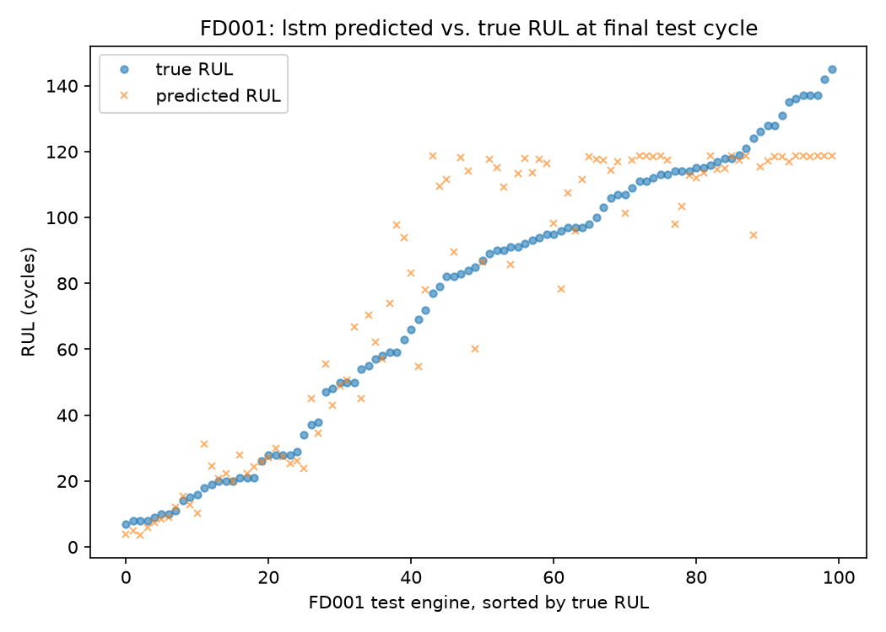
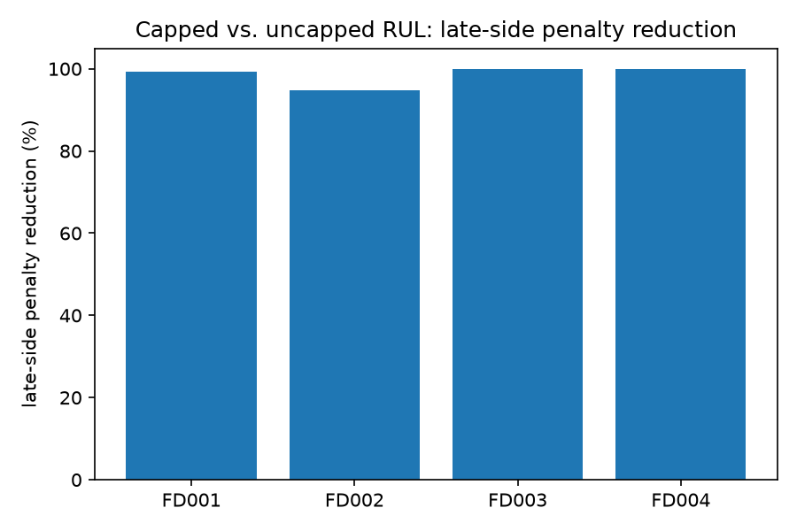

# NASA C-MAPSS Turbofan RUL Prediction

Predicting how many operating cycles a jet engine has left before it fails, from raw sensor telemetry. A remaining useful life (RUL) prediction pipeline built on NASA's C-MAPSS turbofan degradation dataset, covering all four of its sub-datasets with both a gradient-boosted tree model (XGBoost) and a recurrent neural network (LSTM).

## The problem, in plain language

Jet engines don't fail without warning. As parts wear, sensor readings (temperatures, pressures, fan speeds) drift in measurable ways before anything actually breaks. If you can predict *how many cycles are left* from those readings, you can schedule maintenance right before failure instead of on a fixed calendar (too conservative, wastes engine life) or after something breaks (too late, and expensive or dangerous).

That's remaining useful life (RUL) prediction: given an engine's sensor history up to today, predict how many more operating cycles it has before it fails. Predicting too early wastes serviceable engine life; predicting too late risks an in-service failure. Those two mistakes aren't equally bad. Being wrong in the "too late" direction is the one that actually costs you an engine, so the scoring in this project (see below) penalizes it far more harshly than being early.

## The dataset

[C-MAPSS](https://www.nasa.gov/intelligent-systems-division/discovery-and-systems-health/pcoe/pcoe-data-set-repository/) (Commercial Modular Aero-Propulsion System Simulation) is a NASA-simulated turbofan engine degradation dataset, not real flight data, but a physics-based simulation designed to look like it. It ships as four separate sub-datasets that vary in difficulty:

| Dataset | Operating conditions | Fault modes | Train engines | Test engines |
|---|---|---|---|---|
| FD001 | 1 | 1 | 100 | 100 |
| FD002 | 6 | 1 | 260 | 259 |
| FD003 | 1 | 2 | 100 | 100 |
| FD004 | 6 | 2 | 249 | 248 |

Each file is space-delimited with no header row: engine unit ID, cycle number, 3 operational settings, and 21 sensor readings, one row per engine per cycle. **Train** files run every engine to failure. **Test** files are truncated partway through an engine's life. The true remaining life at that cutoff point lives in a separate `RUL_FDxxx.txt` file, one value per engine.

Get the raw data from NASA's [PCoE Data Set Repository](https://www.nasa.gov/intelligent-systems-division/discovery-and-systems-health/pcoe/pcoe-data-set-repository/) and unzip it into `data/raw/` (gitignored; this repo doesn't ship NASA's data, only the code that processes it). See `docs/dataset-reference.md` for the full file-format and scoring reference.

## Pipeline

Each stage is its own module in `src/`; `pipeline.py` is the only one that actually runs anything end to end.

1. **`load.py`**: reads the headerless train/test/RUL files, assigns column names, strips the phantom columns pandas produces from trailing whitespace.
2. **`regimes.py`**: FD002/FD004 mix 6 different operating conditions together, which swamps the degradation signal if left alone. K-means (k=6) recovers the conditions from the 3 operational settings, then each sensor is standardized *within its condition*, so a reading means the same thing regardless of which condition produced it. No-op for FD001/FD003, which only have one condition.
3. **`features.py`**: builds the RUL training target (see the cap decision below) and engineers per-sensor features: rolling mean/std/slope and a Savitzky-Golay smoothed trend, all computed per engine so one engine's history never bleeds into another's.
4. **`models.py`**: trains XGBoost (plus an uncapped-RUL baseline used only for the ablation below) and an LSTM, one of each per dataset.
5. **`scoring.py`**: RMSE, the NASA asymmetric penalty score, GroupKFold cross-validation (training side), and final-cycle test evaluation (test side); these are two genuinely different things, see below.
6. **`pipeline.py`**: runs the above in order for one dataset or all four, writes results to `results/` and diagnostic figures to `figures/`.

## Why the split is by engine, not by row

The single most common way this dataset gets faked is splitting by row instead of by engine unit. If a few cycles from the same engine end up on both sides of a train/test split, the model can partly memorize that engine's specific failure signature instead of learning general degradation patterns, and the reported RMSE looks great for the wrong reason. This project splits and cross-validates **by unit** everywhere: `GroupKFold` for training-side cross-validation, and test-side scoring is one prediction per engine at its last recorded cycle (never per-row), checked directly against `RUL_FDxxx.txt`.

The tripwire for this specific failure: FD001 test RMSE under 11 means the split leaked; a real model on this dataset cannot do that well. It's a smell test only for the "too good" direction; landing above a published range isn't automatically suspicious (see the investigation notebooks in `notebooks/` for a case where it wasn't).

## Why RUL is capped, and what that costs you

An engine at cycle 5 and the same engine at cycle 80 both look equally healthy in the sensor data. Wear just isn't observable that early. Training a model on the literal cycles-remaining count (which might be 300 for a healthy-looking engine) teaches it to fit noise on the flat, healthy part of an engine's life. So the training target is piecewise linear: `min(true_RUL, 125)`. Every engine's target flattens out at 125 once it's healthy enough, and only counts down for real once it's actually close to failure.

That decision has a real, quantified cost: since the model never sees a training example labeled above 125, it can't confidently predict much higher than that either. For any test engine whose recorded history happens to stop while it's still well above the cap, the model's prediction is capped by what it learned, and the true answer isn't. That's an unavoidable blind spot for it, and one that most published C-MAPSS work also handles this exact way. **This is exactly why the results below report more than one RMSE number**; see the explanation under Results.

## Required outputs

1. **FD001 test RMSE, final model (LSTM), mean across 5 seeds: 15.03 ± 0.86.** The LSTM was chosen as the final model because it beats XGBoost's RMSE on every one of the four datasets, with zero hyperparameter tuning. A single run's RMSE drifts noticeably between identical reruns (a documented TensorFlow CPU non-determinism quirk that two separate fixes didn't fully close), so this is reported as a mean and standard deviation across 5 seeds rather than one number; see `docs/dataset-reference.md` for the individual per-seed values and why the drift exists.
2. **Reduction in late predictions from the RUL cap: 24.82%.** See the ablation below for what this means and how it's computed.

## Results

Two RMSE numbers are reported per dataset per model, because they answer different questions, not because one is "the real one":

- **Capped-label RMSE** scores predictions against `min(true RUL, 125)`: test labels capped the same way training labels are, which is the convention a good share of published C-MAPSS work also uses.
- **Raw-label RMSE** scores against the RUL file exactly as NASA provides it, uncapped, a stricter measure that directly reflects the cap's blind spot described above.

| Dataset | Model | Capped-label RMSE | Raw-label RMSE | NASA score (capped) |
|---|---|---|---|---|
| FD001 | XGBoost | 17.44 | 18.57 | 538.82 |
| FD001 | LSTM | 14.60 | 15.72 | 470.83 |
| FD002 | XGBoost | 15.51 | 27.71 | 1,063.36 |
| FD002 | LSTM | 13.92 | 26.26 | 956.58 |
| FD003 | XGBoost | 15.17 | 16.86 | 433.90 |
| FD003 | LSTM | 11.53 | 13.49 | 271.12 |
| FD004 | XGBoost | 16.56 | 28.24 | 1,439.73 |
| FD004 | LSTM | 14.02 | 27.37 | 1,092.38 |

FD001/FD003 barely move between the two columns. FD002/FD004 jump by roughly 12 cycles, and that gap is fully explained by arithmetic, not a bug: FD002/FD004 have a genuinely harder learning problem on paper (6 mixed operating conditions and, for FD004, 2 fault modes, versus 1 of each for FD001/FD003), though as the below-cap check right below shows, that difficulty is largely absorbed by the regime normalization and the larger training set. Per NASA's own test-truncation process, FD002/FD004 also have roughly double the share of test engines truncated while still well above the 125-cycle cap (22%/27% vs. 11%/15% for FD001/FD003), exactly the scenario the cap can't handle. A full diagnostic pass (regime/scaler train-test handoff, short-sequence handling, the residual distribution, and this evaluation-convention effect) ruled out a pipeline bug and is documented in `notebooks/eda_fd002_fd004_gap_investigation.ipynb`.

One more check worth calling out: restricting scoring to *only* the test engines whose true RUL already sits at or below 125 (where capped and raw labels are identical, so there's no convention question left at all) still puts FD002/FD004's LSTM around 13.6-14.0, modestly ahead of FD001's 14.4 on the same subset. That's a genuinely interesting result on its own (likely the per-condition regime normalization earning its keep, plus FD002 simply having 2.6x FD001's training data), not just an artifact of the cap creating "free" points, confirmed directly in the same notebook, including a check that each RMSE is computed over exactly one prediction per test engine (100/259/100/248), not one per row.

### RUL cap ablation: how much does capping actually help?

To isolate the cap's effect from everything else, an uncapped-RUL baseline is trained with the *identical* model and features; only the training target differs (raw RUL vs. capped RUL). The main comparison is the plain share of test engines predicted late (capped model vs. uncapped baseline):

| Dataset | % engines predicted late, uncapped baseline | % engines predicted late, capped model | Reduction in late predictions | Penalty reduction (see note) |
|---|---|---|---|---|
| FD001 | 59.0% | 50.0% | 15.25% | 99.30% |
| FD002 | 59.5% | 41.3% | 30.52% | 94.78% |
| FD003 | 71.0% | 54.0% | 23.94% | 100.00% |
| FD004 | 71.0% | 50.0% | 29.55% | 99.91% |
| **Headline (mean across datasets)** | **65.1%** | **48.8%** | **24.82%** | **98.50%** |

The last column is the drop in the NASA score's *summed* late-side penalty rather than the plain count above. Because that penalty is exponential in how late a prediction is, a small number of very-late predictions can dominate it, which is why it swings so much higher than the count-based reduction next to it; the count is the more interpretable measure of what capping actually buys you. Capping the training target meaningfully cuts how often the model predicts late, from roughly two-thirds of engines down to under half, though it doesn't come close to eliminating late predictions the way the penalty figure alone would suggest.

## Diagnostic figures

**Predicted vs. true RUL, FD001, LSTM** (`figures/fd001_pred_vs_true.png`): every FD001 test engine's true and predicted RUL, sorted by true RUL, so systematic bias would show up as the two lines diverging rather than just tracking noisily together.



**Reduction in late predictions by dataset** (`figures/late_side_reduction.png`): the RUL cap ablation above, visualized per dataset.



## Reproduce

```
git clone <this repository's URL>
cd nasa-cmapss-rul
python -m venv .venv
.venv\Scripts\Activate.ps1        # PowerShell, on Windows
pip install -r requirements.txt
```

Download C-MAPSS from [NASA's PCoE repository](https://www.nasa.gov/intelligent-systems-division/discovery-and-systems-health/pcoe/pcoe-data-set-repository/) and unzip it into `data/raw/` so it contains `train_FD00x.txt`, `test_FD00x.txt`, and `RUL_FD00x.txt` for x in 1-4.

```
python -m src.pipeline FD001        # a single dataset
python -m src.pipeline --all        # all four datasets, writes results/ and figures/
```

Full parameter choices, EDA justifying them, and the fixed seed (42) used everywhere it applies are in `docs/dataset-reference.md` and the `notebooks/` directory.
